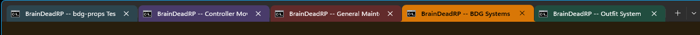
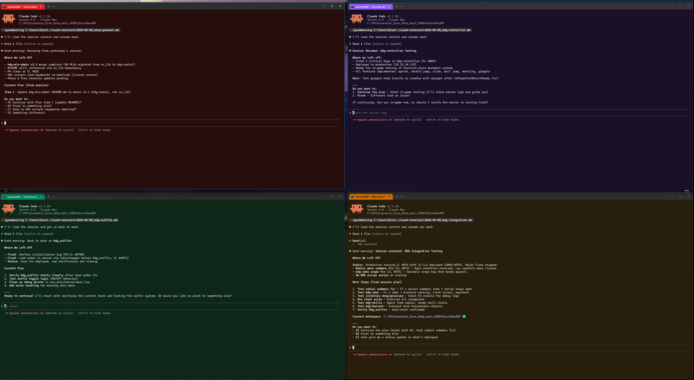
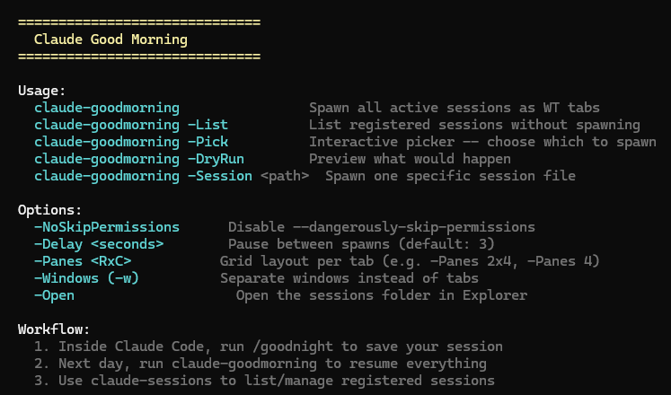
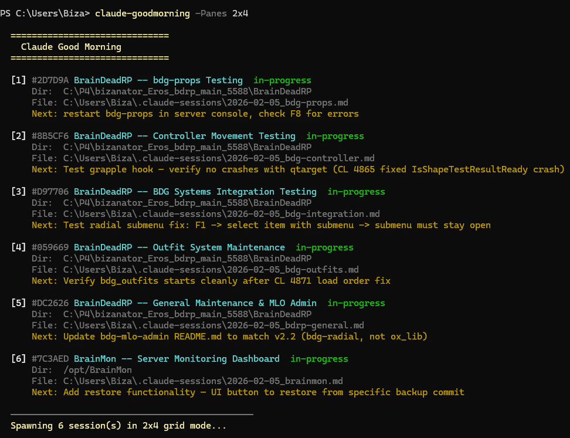
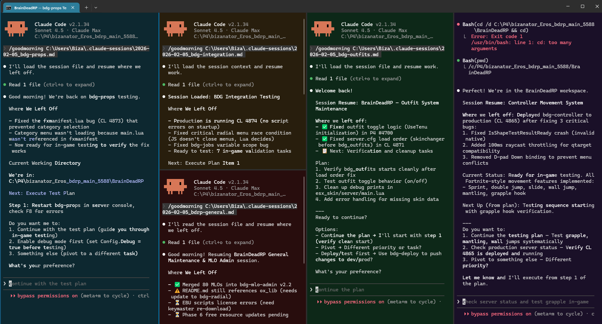

# ☀️ Good Morning, Claude

**One command reopens all of yesterday's work.** Persist and resume Claude Code sessions across restarts -- save all your active sessions at end of day, reopen them all in the morning with full context.

Supports tabs, panes, grid layouts, separate windows, and remote SSH sessions. Tab mode by default lets you drag windows out if you want :)



```
claude-goodmorning
```

 Window mode shown above - use "claude-goodmorning -w"

**🧠 BrainDeadGuild**

*Don't Be BrAIn Dead Alone*

*🎮 Games | 🤖 AI | 👥 Community*

[](https://braindeadguild.com/discord) [](https://braindead.tv/)

## 🎯 About BrainDeadGuild

**BrainDeadGuild** started in 2008 as a gaming community and evolved into a collaboration of gamers, streamers, AI creators, and game developers. We're focused on:

- 🎮 **Game Development** -- UEFN / Fortnite projects
- 🧠 **AI-Assisted Creation** -- tools and workflows
- 📺 **BrainDead.TV** -- shared lore, characters, and worlds (including the City of Brains universe)

The tools we release (like this one) are built for our own game and content pipelines, then shared openly when they're useful to others.

## ⚙️ How It Works

```
End of day:                          Next morning:
+-----------------------+            +------------------------+
| Claude Code (Proj A)  |--/goodnight-->|                        |
| Claude Code (Proj B)  |--/goodnight-->|  session-registry.json |
| Claude Code (SSH: C)  |--/goodnight-->|  (central manifest)    |
+-----------------------+            +------------+-----------+
                                                  |
                                       claude-goodmorning
                                                  |
                                     +------------v-----------+
                                     | WT Tab: Proj A + ctx   |
                                     | WT Tab: Proj B + ctx   |
                                     | WT Tab: SSH -> C + ctx |
                                     +------------------------+
```

## 📦 Install

```powershell
git clone https://github.com/BizaNator/GoodMorningClaude.git
cd GoodMorningClaude
.\Install.ps1
```

The installer handles:
- 📝 `/goodnight` and `/goodmorning` slash commands -> `~\.claude\commands\`
- 📜 `claude-goodmorning.ps1` and `claude-sessions.ps1` -> `~\.local\bin\` (or custom path)
- 📁 Creates `~\.claude-sessions\` storage directory
- 🔤 Adds UTF-8 BOM to scripts (required for PowerShell 5.1)
- 🔓 Sets ExecutionPolicy to RemoteSigned if needed
- 🛡️ Removes Zone.Identifier from downloaded files (Unblock-File)
- 📍 Adds script directory to PATH if needed
- 🎨 Optionally installs Windows Terminal color schemes and profile

### 🔧 Troubleshooting

**"File cannot be loaded... not digitally signed"**
Scripts downloaded from the internet get a Zone.Identifier that blocks execution under RemoteSigned policy. The installer runs `Unblock-File` automatically. If you hit this manually:
```powershell
Unblock-File ~\.local\bin\claude-goodmorning.ps1
Unblock-File ~\.local\bin\claude-sessions.ps1
```

**"The string is missing the terminator" or other parse errors**
PowerShell 5.1 reads `.ps1` files as Windows-1252 unless they have a UTF-8 BOM. Non-ASCII characters (em dashes, box drawing) get silently corrupted into smart quotes, breaking the parser. The installer adds a BOM automatically. If you copy scripts manually, ensure they have a UTF-8 BOM.

**"Raw mode is not supported" from Claude Code**
This happens if you pipe content into `claude` (e.g., `$content | claude`). Claude Code needs a real TTY for its interactive UI. The goodmorning script avoids this by using a `.cmd` launcher and passing `/goodmorning <path>` as the initial prompt instead of piping.

## 🚀 Usage

### 📋 Use -help for a list of all commands



### 🌙 End of Day -- Save Sessions

Inside each Claude Code session:

```
/goodnight                        # Save session with auto-detected context
/goodnight focusing on auth bug   # Add a note for tomorrow
```

This creates a structured markdown file in `~\.claude-sessions\` and registers the session in `session-registry.json`. Works for both local and SSH sessions -- the host is recorded automatically.

### ☀️ Next Morning -- Resume Everything

From PowerShell:

```powershell
claude-goodmorning                # Spawn ALL active sessions as WT tabs
claude-goodmorning -List          # See what's registered without spawning
claude-goodmorning -Pick          # Interactive: choose which to spawn
claude-goodmorning -DryRun        # Preview what would happen
claude-goodmorning -Session "C:\...\.claude-sessions\2026-02-05_myproject.md"
claude-goodmorning -Open          # Open sessions folder in Explorer
claude-goodmorning -Help          # Full usage info
```

Options:

```powershell
claude-goodmorning -Panes "2x4"   # 2-row x 4-column grid layout
claude-goodmorning -Panes 4       # 4 side-by-side columns (1 row)
claude-goodmorning -Windows       # Separate windows instead of tabs
claude-goodmorning -Delay 5       # 5 second pause between spawns
claude-goodmorning -NoSkipPermissions  # Don't pass --dangerously-skip-permissions
```

Each session opens in a new Windows Terminal tab/pane with:
- 📂 Correct working directory (local) or SSH connection (remote)
- 💬 `/goodmorning` command auto-sent as first message to load context
- ⚡ `--dangerously-skip-permissions` (disable with `-NoSkipPermissions`)
- 🎨 Unique color scheme per pane for visual identification
- 🏷️ Pane title showing session name (`--suppressApplicationTitle`)

### 📋 Manage Sessions

```powershell
claude-sessions                   # List active sessions
claude-sessions -All              # Show all including done
claude-sessions -Done "myproject" # Remove a project from registry
claude-sessions -Remove 2         # Remove entry #2
claude-sessions -Clean            # Remove entries with missing files
claude-sessions -Open             # Open sessions folder in Explorer
claude-sessions -Help             # Full usage info
```

### 🔄 Inside a Running Session

If you opened Claude Code manually (not via `claude-goodmorning`):

```
/goodmorning                      # Load context for current project
/goodmorning C:\path\to\session.md  # Load a specific session file
```

## 🎛️ Interactive Menu

**New!** Don't want to remember command-line flags? Use the interactive menu system for a guided experience:

```powershell
claude-menu
```


The menu provides a user-friendly interface for:

### Main Menu Options:
1. **Resume saved sessions** - Interactive picker for your active sessions (same as `claude-goodmorning -Pick`)
2. **Launch new session(s)** - Sub-menu for launching fresh Claude instances
   - Single local path
   - Single remote path (SSH)
   - Multiple targets (advanced)
   - From saved profile
3. **Manage sessions** - Sub-menu for session management
   - List all sessions or active only
   - Mark sessions as done
   - Remove sessions
   - Clean orphaned entries
   - Sync Wave Terminal connections
   - Refresh tmux status for remote sessions
   - Open sessions folder in Explorer
4. **Configure defaults** - Sub-menu for preferences
   - Default pane layout (e.g., "2x2", "3x4", or tab mode)
   - Default terminal (auto, wave, wt, cmd)
   - Toggle windows mode (separate windows vs single window)
   - Toggle skip permissions flag
   - Set launch delay (seconds between spawning sessions)
   - Reset all settings to defaults
5. **Exit**

### Configuration Persistence

The menu saves your preferences to `~/.claude-sessions/menu-config.json`. Your defaults apply to all menu-initiated launches and can be changed anytime via the Configure menu.

**Pro tip:** Use the menu for quick one-off tasks, and use the command-line scripts directly when you have specific flags or when scripting workflows.

## 🚀 Launch Fresh Sessions

Need to spin up a batch of fresh Claude Code instances without any saved session context? Use `claude-launch` to open multiple tabs/panes targeting local or remote paths.

### 🎯 Basic Usage

```powershell
# Target strings: "user@host:/path xN"
claude-launch "home@brainz:/opt/ai-server-config x2" "home@brainz:/opt/game-server-config x2" -Panes "2x2"

# Single-target shorthand
claude-launch -Host "home@brainz" -Path "/opt/ai-server-config" -Count 4 -Panes "2x2"

# Local targets
claude-launch -Path "C:\tools\myproject" -Count 2 -Panes "1x2"

# Terminal only (no Claude)
claude-launch -Path "C:\tools" -NoClaude

# Dry run preview
claude-launch -DryRun -Path "C:\tools" -Count 2 -Panes "1x2"
```

### 📝 Target String Format

Three ways to specify targets:

**1. Positional target strings** -- Most flexible:
```
"user@host:/path xN"   # Remote SSH (@ distinguishes from C:\ drive letters)
"C:\local\path xN"      # Local path
```
The `xN` suffix is optional (defaults to `x1`). Examples:
```powershell
claude-launch "home@brainz:/opt/config x2" "C:\tools\myproject"
```

**2. Single-target shorthand** -- Named parameters for one target:
```powershell
claude-launch -Host "home@brainz" -Path "/opt/config" -Count 4 -Label "Config"
claude-launch -Path "C:\tools" -Count 2
```

**3. Profiles** -- Saved configurations (see below).

### 📋 Profiles

Save frequently-used launch configurations to `~\.claude-sessions\launch-profiles.json`:

```powershell
# Save a profile
claude-launch -SaveProfile "brainz-servers" "home@brainz:/opt/ai-server-config x2" "home@brainz:/opt/game-server-config x2" -Panes "2x2"

# Launch from profile
claude-launch -Profile "brainz-servers"

# Manage profiles
claude-launch -ListProfiles
claude-launch -DeleteProfile -Profile "brainz-servers"
```

**Profile JSON format:**
```json
{
  "brainz-servers": {
    "description": "Remote server config sessions",
    "panes": "2x2",
    "targets": [
      { "host": "home@brainz", "path": "/opt/ai-server-config", "count": 2, "label": "AI Server" },
      { "host": "home@brainz", "path": "/opt/game-server-config", "count": 2, "label": "Game Server" }
    ]
  }
}
```

### ⚙️ Options

```powershell
# Mode Options
-NoClaude                   # Open terminal only (no Claude Code)
-NoSkipPermissions          # Don't pass --dangerously-skip-permissions to Claude

# Layout Options
-Panes "2x2"                # Grid layout (rows x columns)
-Panes 4                    # Single row, 4 columns
-Windows                    # Separate windows instead of tabs

# Execution Options
-Delay 5                    # Pause between spawns in seconds (default: 3)
-DryRun                     # Preview what would launch without executing
-Help                       # Show full usage information

# Profile Options
-Profile "name"             # Load saved profile
-SaveProfile "name"         # Save current targets as profile
-ListProfiles               # Show all saved profiles
-DeleteProfile -Profile "name"  # Delete a saved profile

# Target Options (single-target shorthand)
-Host "user@hostname"       # SSH host for single target
-Path "C:\path"             # Local or remote path
-Count 4                    # Number of instances (default: 1)
-Label "Name"               # Custom label for pane titles
```

### 🔄 Claude Mode vs NoClaude Mode

**Claude Mode (default):**
- Launches `claude --dangerously-skip-permissions` in each pane
- Remote sessions: `ssh user@host -t "cd '/path' && claude ..."`
- Local sessions: `cd /d "C:\path" && claude ...`

**NoClaude Mode (`-NoClaude`):**
- Opens plain terminal/shell in each pane
- Remote sessions: `ssh user@host -t "cd '/path' && exec $SHELL -l"`
- Local sessions: `cd /d "C:\path" && cmd /k`
- Useful for quick terminal access or manual workflows

## 🔲 Pane Grid Layout

The `-Panes "RxC"` option arranges sessions in a grid within a single Windows Terminal tab:



```
-Panes "2x4" with 8 sessions:
+--------+--------+--------+--------+
| Sess 1 | Sess 2 | Sess 3 | Sess 4 |    (Claude Teal, Purple, Amber, Emerald)
+--------+--------+--------+--------+
| Sess 5 | Sess 6 | Sess 7 | Sess 8 |    (Claude Red, Violet, Cyan, Gold)
+--------+--------+--------+--------+
```

If you have more sessions than fit in one grid, additional tabs are created automatically. Plain `-Panes 4` creates a single row of 4 columns.



## 🌊 Wave Terminal Support

**New!** Good Morning, Claude now supports [Wave Terminal](https://www.waveterm.dev/) as an alternative to Windows Terminal.

### What is Wave Terminal?

Wave is a modern, open-source terminal with built-in SSH connection management, persistent remote sessions, and cross-platform support (Windows, macOS, Linux).

### Automatic SSH Connection Generation

When you save remote sessions with `/goodnight`, Good Morning Claude automatically generates Wave Terminal connection profiles:

```powershell
claude-sessions -SyncWave
```

This creates/updates `~/.config/waveterm/config/connections.json` (or Windows equivalent) with:
- SSH connection details (user@host)
- Tmux auto-attach initscripts (see Tmux section below)
- Wave-specific settings for each remote host

### Using Wave Terminal

**Automatic detection:**
```powershell
claude-goodmorning          # Uses Wave if installed, otherwise falls back to WT/cmd
```

**Explicit selection:**
```powershell
claude-goodmorning -Terminal wave
claude-launch -Terminal wave -Path "/opt/myproject" -Count 2
```

**Set as default:**
Edit `~/.claude-sessions/terminal-config.json`:
```json
{
  "preferredTerminal": "wave",
  "fallbackChain": ["wave", "windowsterminal", "cmd"]
}
```

### Wave Limitations

- **Grid panes not supported** - Wave uses a single-pane-per-tab model. If you specify `-Panes`, Good Morning Claude will warn and fall back to tab mode.
- **Manual launcher execution** - Wave doesn't support command-line arguments for executing commands on launch (yet). For local sessions, you'll need to run the displayed launcher command manually. For remote sessions with tmux, the initscript handles this automatically.

### Best Practices with Wave

1. **Use tmux for remote sessions** (automatic, see next section) - The tmux initscript auto-attaches, so you don't need to run commands manually
2. **Sync connections regularly** - Run `claude-sessions -SyncWave` after saving new remote sessions
3. **Use the menu** - `claude-menu` handles terminal selection and syncing for you

## 🖥️ Tmux Persistence for Remote Sessions

**New!** Remote SSH sessions automatically use tmux for persistence. Disconnect your workstation, reconnect later, and your Claude session is still there.

### How It Works

When you save a remote session with `/goodnight`, Good Morning Claude:
1. Detects you're in an SSH session (checks `$SSH_CONNECTION` or `$SSH_CLIENT`)
2. Records the tmux session name (either current session or generates `claude-<session-slug>`)
3. Stores this in both the session file and registry

When you run `claude-goodmorning` (or use Wave Terminal):
1. Launcher checks if tmux session exists on remote host
2. If exists: Attaches to existing session (your Claude instance is still running!)
3. If not: Creates new tmux session and starts Claude

### Tmux Session Naming

Sessions are named `claude-<session-slug>` by default:
- `claude-brainmon-dashboard`
- `claude-bdrp-props-system`

If you're already in a tmux session when you run `/goodnight`, it uses that session name instead.

### Managing Tmux Sessions

**Check tmux status:**
```powershell
claude-sessions -RefreshTmux
```

This connects to each remote host and checks:
- Does the tmux session exist?
- Is it attached or detached?
- When was it last seen?

**View in session list:**
```powershell
claude-sessions           # Shows tmux status for remote sessions
```

Example output:
```
[1] BrainMon -- Dashboard  in-progress
    /opt/BrainMon
    Terminal: auto | Updated: 2026-02-08T10:30:00
    Tmux: claude-brainmon-dashboard (detached)
```

### Manual Tmux Operations

You can always manually manage tmux sessions:
```bash
# On remote host
tmux ls                                    # List all sessions
tmux attach -t claude-brainmon-dashboard   # Attach to specific session
tmux detach                                # Detach (Ctrl+B, D)
tmux kill-session -t claude-brainmon-dashboard  # Kill session
```

### Tmux Hotkey Reference

**Essential Keybindings** (configured in `~/.tmux.conf`):

**Prefix Key:** `Ctrl+B` (press before most commands below)

**Window Management:**
- `Prefix + C` - Create new window
- `Prefix + N` - Next window
- `Prefix + P` - Previous window
- `Prefix + 0-9` - Switch to window number
- `Prefix + ,` - Rename current window
- `Prefix + &` - Kill current window (with confirmation)

**Pane Management:**
- `Prefix + |` - Split pane vertically (side by side)
- `Prefix + -` - Split pane horizontally (top/bottom)
- `Alt+Arrow` - Navigate between panes (no prefix needed!)
- `Ctrl+Arrow` - Resize current pane (no prefix needed!)
- `Prefix + X` - Kill current pane (with confirmation)
- `Prefix + Z` - Toggle pane zoom (fullscreen)
- `Prefix + Q` - Show pane numbers (4 seconds)

**Session Management:**
- `Prefix + D` - Detach from session (keeps running)
- `Prefix + S` - List all sessions
- `Prefix + $` - Rename current session

**Copy Mode (Vim-style):**
- `Prefix + [` - Enter copy mode (scroll/search)
- `V` - Begin selection (in copy mode)
- `Y` - Copy selection and exit (in copy mode)
- `Escape` - Cancel copy mode
- `Prefix + ]` - Paste copied text

**Other Useful:**
- `Prefix + R` - Reload tmux config
- `Prefix + ?` - List all keybindings
- `Prefix + T` - Show clock

**Mouse Support:**
- Click pane to focus
- Drag pane border to resize
- Click window name to switch
- Scroll wheel to scroll history

**Pro Tips:**
- Mouse support is enabled by default in our config
- Panes remember their working directory when splitting
- Status bar shows session name, windows, and time
- Active pane has a purple border
- 50,000 line scrollback buffer

### Fallback Behavior

If tmux is not installed on the remote host, Good Morning Claude automatically falls back to direct SSH (no persistence). The session will work, but won't survive disconnects.

## ⚙️ Terminal Configuration

Good Morning Claude uses a pluggable terminal provider system. You can configure which terminal to use globally or per-session.

### Global Configuration

Edit `~/.claude-sessions/terminal-config.json`:
```json
{
  "preferredTerminal": "auto",
  "fallbackChain": ["wave", "windowsterminal", "cmd"],
  "waveEnabled": true,
  "wtEnabled": true,
  "tmuxAutomatic": true
}
```

**Options:**
- `preferredTerminal`: "auto", "wave", "wt" (or "windowsterminal"), "cmd"
- `fallbackChain`: Order of terminals to try when auto-detecting
- `waveEnabled` / `wtEnabled`: Enable/disable specific terminals
- `tmuxAutomatic`: Automatically use tmux for remote sessions (recommended: true)

### Per-Session Terminal Preference

Override the global default for specific sessions:
```powershell
claude-sessions -SetTerminal 'brainmon-dashboard wave'
```

This stores the preference in the registry. Next time you resume that session, it will use Wave Terminal regardless of the global setting.

### Command-Line Override

Always override with `-Terminal`:
```powershell
claude-goodmorning -Terminal wt     # Force Windows Terminal
claude-launch -Terminal cmd         # Force cmd.exe
claude-menu                          # Uses configured default
```

## 🎨 Windows Terminal Setup

The installer can optionally configure Windows Terminal with:

**"Claude Session" profile** -- Hidden profile with `suppressApplicationTitle: true` so pane titles stick.

**8 custom color schemes** -- Subtle tinted dark backgrounds for visual identification:

| Scheme | Background | Accent |
|--------|-----------|--------|
| 🟦 Claude Teal | `#0D2830` | `#2D7D9A` |
| 🟪 Claude Purple | `#1A1028` | `#8B5CF6` |
| 🟧 Claude Amber | `#281E0D` | `#D97706` |
| 🟩 Claude Emerald | `#0D2818` | `#059669` |
| 🟥 Claude Red | `#280D0D` | `#DC2626` |
| 💜 Claude Violet | `#1A0D28` | `#7C3AED` |
| 🩵 Claude Cyan | `#0D2228` | `#0891B2` |
| 💛 Claude Gold | `#28200D` | `#CA8A04` |

Each pane gets a different scheme automatically. All schemes share the same VSCode-like foreground palette so code readability is identical.

If you skip the WT setup during install, the scripts still work -- they just won't apply color schemes or custom titles.

## 📁 File Structure

```
%USERPROFILE%\.claude-sessions\
+-- session-registry.json              # Central manifest of all active sessions
+-- launch-profiles.json               # Saved claude-launch configurations
+-- 2026-02-05_bdrp-props-system.md    # Session snapshots (slug-based filenames)
+-- 2026-02-05_brainmon-dashboard.md
+-- 2026-02-06_bdrp-props-system.md    # New save = new file, old one stays as history
```

### 📄 Registry Format

```json
[
  {
    "sessionName": "BDRP -- Props System",
    "sessionSlug": "bdrp-props-system",
    "projectName": "braindeadrp",
    "projectPath": "C:\\P4\\BrainDeadRP",
    "host": "",
    "resumePath": "C:\\Users\\BizaNator\\.claude-sessions\\2026-02-05_bdrp-props-system.md",
    "status": "in-progress",
    "lastUpdated": "2026-02-05T18:30:00"
  },
  {
    "sessionName": "BrainMon -- Dashboard",
    "sessionSlug": "brainmon-dashboard",
    "projectName": "brainmon",
    "projectPath": "/opt/BrainMon",
    "host": "home@brainz",
    "resumePath": "C:\\Users\\BizaNator\\.claude-sessions\\2026-02-05_brainmon-dashboard.md",
    "status": "in-progress",
    "lastUpdated": "2026-02-05T22:00:00"
  }
]
```

Multiple sessions can share the same `projectPath` -- each gets a unique `sessionSlug`. Registry matches on slug, not project name.

### 📝 Session File Format

```markdown
# Session: ProjectName -- 2026-02-05

## Status
in-progress

## Session Name
BiloxiStudios -- Storage Recovery

## Project Path
D:\Projects\BiloxiStudios

## Host
<!-- Only for remote/SSH sessions. Omit for local. -->
home@brainz

## Active Tasks
- Troubleshooting Storage Spaces pool reassembly

## Plan / Next Steps
1. Run diskpart to check sector sizes on all drives
2. Try Import-StoragePool with specific subsystem

## Key Context
- 6 SAS drives moved from failed LSI controller to Dell PERC H730
- Core issue: 512e vs 4Kn sector size mismatch

## Files & Paths
- D:\Projects\BiloxiStudios\docs\storage-recovery-notes.md

## Notes
User wants to preserve all data -- no destructive operations without confirmation.
```

## ✅ Requirements

- Windows 10/11
- PowerShell 5.1+ (UTF-8 BOM handled by installer)
- Claude Code CLI (`claude` on PATH)
- Windows Terminal recommended (falls back to plain cmd windows)
- SSH client (for remote sessions)

## 📜 License

MIT License. See [LICENSE](LICENSE) for details.

---

## 💬 Community & Support

**🧠 Don't Be BrAIn Dead Alone!**

[](https://BrainDeadGuild.com/discord)
[](https://BrainDeadGuild.com)

- 💬 **Discord**: [BrainDeadGuild.com/discord](https://BrainDeadGuild.com/discord) - Get help, share creations, suggest features
- 🌐 **Website**: [BrainDeadGuild.com](https://BrainDeadGuild.com)
- 📺 **Lore & Content**: [BrainDead.TV](https://BrainDead.TV)
- 🐙 **GitHub**: [github.com/BrainDeadGuild](https://github.com/BrainDeadGuild)

### 🛠️ Other BrainDead Tools

Check out our other free tools for creators:

| Tool | Description |
|------|-------------|
| [ComfyUI-BrainDead](https://github.com/BizaNator/ComfyUI-BrainDead) | Custom nodes for ComfyUI - character consistency, prompt tools, and more |
| [BrainDeadBlender](https://github.com/BizaNator/BrainDeadBlender) | Blender add-ons for 3D artists and game developers |
| [BrainDeadBackgroundRemover](https://github.com/BizaNator/BrainDeadBackgroundRemover) | Free AI background removal - drag, drop, done |

---

*A [Biloxi Studios Inc.](https://BrainDeadGuild.com) Production*
